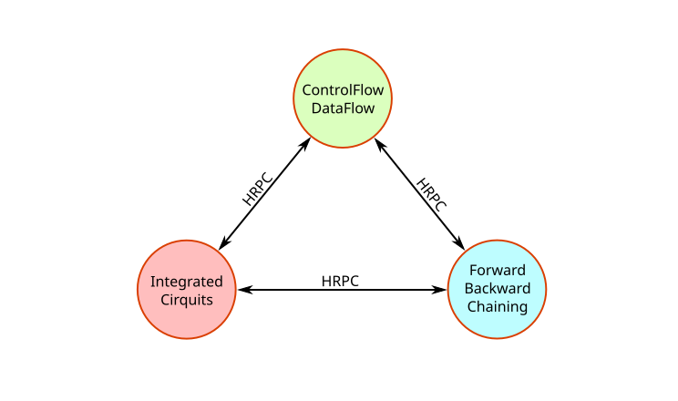
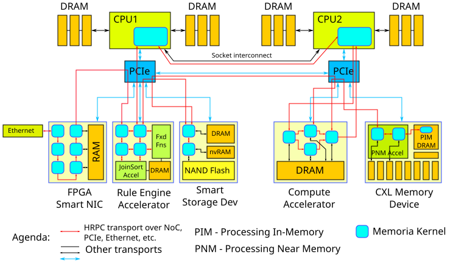
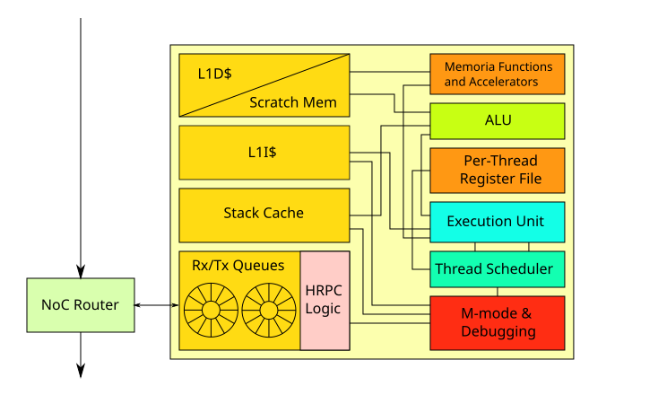
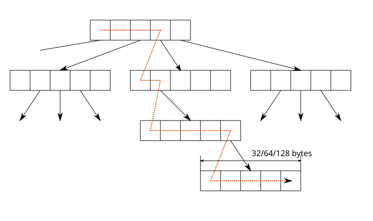
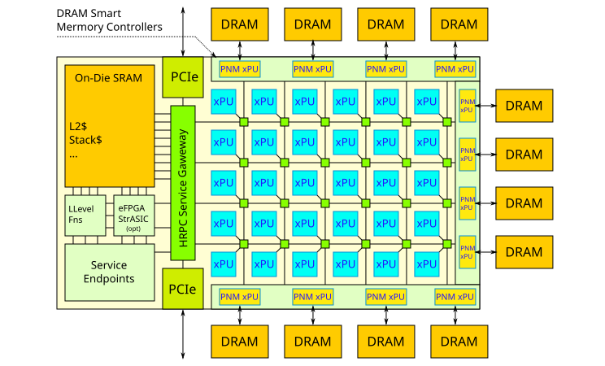
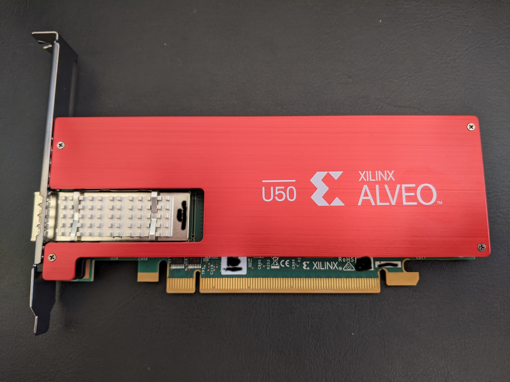

# LCM — Logos Compute Model

> Data dominates. If you've chosen the right data structures and organized things well, the algorithms will almost always be self-evident. Data structures, not algorithms, are central to programming.
>
> — Rob Pike, [Notes on Programming in C](http://www.lysator.liu.se/c/pikestyle.html), 1989.

LCM is the compute model Logos targets. It is not a description of any one machine. It is the abstract substrate the language is designed *for*: a set of small cores (xPUs) exchanging messages over a hardware-accelerated transport (HRPC), placed as physically close to the data they touch as the platform allows.

x86_64/Linux is, from this point of view, **just one of the targets** — a particularly large and well-supported one, and currently the only target the toolchain produces native binaries for. It is not the architectural centre. Logos does not yet have language-level features for declaring which functionality is available on which target; that will come later, alongside richer cross-target tooling.

This document describes the LCM as a compute model and a target class for Logos. It is the architectural inheritance from the [Memoria Framework](https://github.com/victor-smirnov/memoria), reframed: the substrate moves into Logos, while Memoria continues as a separate framework and becomes, over time, something like an *operating system* for LCM — the data layer, processing layer, and structured-storage layer that runs on top.

## Why LCM Looks This Way

Processing can be compute-intensive, IO-intensive, or hybrid. It is *compute-intensive* when each element of data is processed many times (sorting, matrix multiplication); otherwise it is *IO-intensive* (hash tables, random-access structured queries). Hybrid workloads contain both, but in clearly separable stages — JOIN is IO-intensive, SORT is compute-intensive, and an SQL query may go through both.

Compute/IO-intensity is not an intrinsic property of an algorithm; it is a property of an algorithm against a *memory architecture*. By IO we mean off-die traffic, which is typically 100–1000× slower than intra-die traffic. Each algorithm has an access pattern — predictable, random, or mixed — and good performance comes from arranging data so most access stays intra-die.

Mainstream CPUs lean almost entirely on **caching and prefetching** to bridge this gap. It works well in many cases, and it is not going away. But it has well-known costs:

- Caching is not free. A miss costs dozens of cycles; a hit still pays for tag lookup. Raw scratchpad SRAM can be much faster in the best case.
- Caching interacts badly with virtual memory: address translation, TLB misses, context-switch invalidation.
- Caching of *mutable* data does not scale well across cores — coherency traffic dominates.
- To extract performance under irregular memory latency, cores grow into large, hot, expensive out-of-order machines.

Raw DDR5 latency is around 25–40 ns; full system latency is roughly 75 ns; under TLB pressure, several times that. Inter-core latency on modern multi-socket systems ranges from a few ns (SMT siblings) to [hundreds of ns](https://chipsandcheese.com/2023/11/07/core-to-core-latency-data-on-large-systems) across sockets, with the average on the order of dozens of ns — and worse when many cores talk at once. This makes general-purpose multicore CPUs poor at *fine-grained dynamic parallelism*, even though they are still the best hosts for latency-sensitive workloads like databases, symbolic reasoners, and constraint solvers.

LCM is a response to this. It assumes a different tradeoff: **lots of small cores close to the memory, communicating by message rather than by coherent shared state.**

## Persistent Data Structures as the Default

LCM expects [persistent data structures](https://en.wikipedia.org/wiki/Persistent_data_structure) (PDS) — committed versions are immutable, and immutable data shares freely across parallel processing units without coordination. PDS need garbage collection (atomic reference counting or generational), which in turn needs strongly-ordered, exactly-once delivery — practical at rack and (modest) DC scale.

PDS pay a cost on single-threaded sequential access — O(1) becomes O(log N). Functional languages amortise some of this. The benefits start dominating around 10+ cores; below that, the overhead is real. LCM is designed for the regime where that tradeoff pays.

Accelerating PDS asks the platform for hardware-assisted atomic counters, similar concurrency primitives, and a fabric that supports robust exactly-once delivery (which reduces to bounded-history idempotent counters).

## High-Level Architecture

LCM is inherently heterogeneous and explicitly supports three computation domains, the same three Logos itself plans as first-class language layers (see [language/overview.md](../language/overview.md)):

1. **Generic mixed dataflow and control flow.** Most practical compute- and IO-intensive code, runnable on CPUs or specialised hardware.
2. **Integrated circuits** — fixed (ASIC) and reconfigurable (FPGA, structured ASIC). High performance and low power for stream/mixed-signal stages, with nanosecond-scale event resolution.
3. **Rule- and search-based** — forward chaining (CEP, streaming) and backward chaining (SQL/Datalog).

Domains connect through **[HRPC](../internals/hrpc.md)**, a unified hardware-accelerated RPC + streaming protocol. HRPC is conceptually similar to gRPC — but designed for direct hardware implementation, not for an HTTP/2 software stack. Within LCM, HRPC is the universal transport: intra- and cross-domain communication, including kernel-level traffic, all flow over it.

When HRPC is in hardware, the OS shrinks. There is no longer a single fully-featured kernel mediating every operation; what remains is a **nano-kernel** — only the parts of HRPC that, on a given target, must run as software. A Logos kernel running on a CPU core inside an accelerator can listen to a stream produced by an FPGA, call into smart-storage, or invoke near-memory compute on a CXL device — all through the same protocol.

OS-kernel functionality decomposes into services running on whichever device is closest to the data. Storage — historically the largest piece of OS surface — is owned by ['smart-storage' devices](https://github.com/victor-smirnov/memoria) able to evaluate complex queries in streaming and batching modes.

The right framing is not "hardware-assisted micro-kernel" but **a distributed system scaled down to a single machine**. A large multicore MMU-enabled CPU is no longer the centre of the architecture; it is one PU among many — the one that runs legacy code and code that genuinely needs an MMU.

Memory is no longer a single shared address space. It is a set of buffers with different *affinity* to compute. Programming this directly is harder than programming a flat-memory CPU — but it is also the same kind of work distributed-systems engineers already do at larger scales every day.

LCM does **not** guarantee cross-environment portability. Different accelerators provide different default runtimes, memory hierarchies, and cluster topologies. Some Logos code will need substantive rewrites to move between environments. Logos's job is to keep the unavoidable cost as low as possible — through metaprogramming, metafunction-driven specialisation, and the build/type system as a data platform — not to pretend the cost isn't there.

## xPU — The Processing Element

The reconfigurable extensible processing unit (xPU) is LCM's structural unit. The defining property: **HRPC is the only way it talks to the outside world.** From outside, an xPU is a set of HRPC endpoints described in the usual HRPC tooling (IDL, schema, codegen). That includes:

1. All external memory traffic — cache transfers, DMA.
2. Debug and observability traffic.
3. Runtime exception signalling.
4. Application-level HRPC.

Because everything is HRPC, an xPU can be placed anywhere the HRPC fabric reaches:

- An accelerator cluster.
- A DDR memory controller.
- A DRAM module (near the chips — CXL-mem, PNM-DRAM).
- A stacked die inside a DRAM package (in-package PIM-DRAM).
- A DRAM die itself (PIM-DRAM).
- A network router.
- *...your idea here...*

In all cases the kernel running on the xPU can communicate bidirectionally with the rest of the system through the same protocol it would use locally.

HRPC and the system-level endpoint specs are open, so independent vendors can contribute *specialised cores* and *middleware*. The toolchain is expected to adapt — automatically when the contract is rich enough, with bounded manual effort otherwise.

Logos code can have deep call chains and substantial code size, so an instruction cache is essential (with the usual cost of unpredictable instruction latency). A "stack cache" — a dedicated data cache for thread stacks — is also load-bearing when the internal data memory is being used as a scratchpad rather than a D$.

What an xPU does **not** carry is cache coherency, except in narrow cases where it is genuinely necessary. LCM relies on PDS: mutable data is private to a writer; readers see only immutable data. Where shared structured mutable access is required (atomic ref counting, etc.), it is done through explicit HRPC messages to hardware-accelerated services rather than through coherent shared memory.

## Containers and Memory Parallelism

A *container* is the structured-data unit Memoria contributes to LCM. Containers are block-based and represented as B+Trees, ephemeral or persistent (multi-version). Anything that can be efficiently represented as an array can be efficiently represented as a container. Containers are built from a small set of basic blocks via metaprogramming and specifications; the inputs to that build process are types and metadata, and metafunctions combine them.

There are five basic building blocks (see Memoria docs for detail), all supporting fixed- and variable-length elements:

1. Unsorted array.
2. Sorted array.
3. Array-packed prefix-sums tree.
4. Array-packed searchable sequence.
5. Array-packed compressed symbol sequence.

A search through a multi-ary tree node looks like:

Best performance is at node sizes a low multiple of a cache line (32–128 B). A prefix-sum search accumulates and compares along a node; other tree types do other operations. Instead of running this in CPU cache (and pulling the data through the hierarchy to do it), the work can be offloaded to:

- The memory controller, or
- Processing cores attached directly to memory banks on DRAM dies.

Embedding logic into a DRAM die is hard but possible — *Processing-In-Memory* (PIM). The cheaper alternative is to put logic on the memory module or in the CXL controller — *Processing-Near-Memory* (PNM): lower throughput and parallelism, slightly higher latency, but built on existing process nodes.

The point: accelerating containers wants **as much memory parallelism as possible, with xPUs placed as close to the physical memory as the platform allows.** Existing accelerators — designed for matrix multiplication on neural networks — do not optimise for this, because GEMM is *latency-insensitive*. LCM workloads need a different class of accelerator: maximised effective *memory parallelism*.

## Accelerator Module

The whole point of LCM is to maximise *memory parallelism* by bringing processing to the data — primarily for *latency*, secondarily for *throughput*.

Ideally, every memory bank would have either an xPU or a fixed function attached. Embedding into DRAM dies is technically demanding; some [solutions exist](https://arxiv.org/pdf/2105.03814) commercially. Stacking processing dies onto DRAM is more expensive but maps onto existing manufacturing better. The simplest deployment is an xPU + fixed functions inside the memory controller — operating at memory speed, no caches or clock-domain crossings, but throughput-limited compared to PNM/PIM.

So the architectural marker for "good for LCM workloads" is: **PNM/PIM-style memory parallelism, with latency as the primary optimisation target, not just throughput.**

Beyond PNM/PIM, HRPC, and PDS, LCM does not pin a specific hardware architecture. The figure below is *one instance* of an accelerator the toolchain will support:

Essential components:

1. xPUs — RISC-V cores with hardware support for HRPC and core LCM data-structure operations.
2. Network-on-chip — 2D mesh (simpler, good for matmul) or N-dimensional hypercube (more complex, better latency in the general case).
3. A main HRPC service gateway and many local HRPC routers.
4. Service endpoints for hardware-implemented primitives (atomic ref counting and other shared concurrency primitives).
5. Shared on-die SRAM, distributable, used as scratchpad / cache / rings / hardware-assisted structures.
6. A smart DRAM controller with embedded PNM xPUs and/or hardwired container operations.
7. External connectivity (transceivers, PCIe, etc).

Properties:

- **Scalable.** No system-wide bottlenecks like full-chip cache coherence. Synchronisation primitives (ARC, mutexes) are not theoretically scalable, but in hardware they can be made practically efficient — instead of being software emulations on top of an uncontrollable coherency protocol.
- **Scales down and up.** From MCU-class power budgets to entire-wafer (and beyond) deployments.
- **Composable.** Applications do not assume shared array-structured memory; they use fast structured transactional storage instead. At the hardware level it is a set of chips talking via an open protocol.
- **Extensible.** New functionality can land as RISC-V extensions, hardened shared functions, or HRPC middleware. The only requirement is that everything talk HRPC over published interfaces.

## Matrices and Tensors

Many data structures are arrays. Dense graphs are square matrices, and many graph algorithms reduce to matrix operations. When data really is dense, the static-scheduling and systolic benefits are large.

LCM needs efficient matrix support, but the GEMM-for-NN space is being explored aggressively elsewhere — both hardware and compilers — and is close to its local optimum. Logos' primary focus is **sparse data structures via PIM/PNM** with low memory-access latency. Three reasonable strategies for fusing GEMM into LCM:

1. Add systolic processors / CGRAs to xPUs as HRPC-accessible devices. Area is wasted when unused.
2. A separate GEMM-optimised xPU, or a separate accelerator module, inside the LCM ecosystem.
3. Outsource to external projects with substantial open and proprietary interest in GEMM.

In all three, hardware HRPC is foundational — for both intra-LCM communication and integration with external systems. The whole HRPC story is to *generate* IP from semantically-rich IDL, the way SOA codegen does in distributed software today; specifying interfaces in one place and generating software (and hardware) artifacts from them is how the complexity stays manageable. Hardware HRPC and its tooling are a long-term priority.

## CPU Mode

Multicore MMU-enabled CPUs are not the best LCM substrate — MMU overhead, the memory hierarchy, and OS scheduling all work against the model. They are also, by an enormous margin, the largest deployment base, and that base will keep growing for the foreseeable future. They are also the only target Logos compiles to today.

So Logos treats CPU mode as a first-class member of the target family. As specialised hardware becomes available, it joins the family incrementally — without dethroning CPU support.

## Where Logos Fits

LCM is the architectural target; Logos is the language and toolchain aimed at it.

- **Writ** — the relocatable tagged data substrate — is the on-disk, in-memory, and on-the-wire shape of structured data across LCM. There is no FFI between values and data; a document is just a value. See [language/writ.md](../language/writ.md).
- **HRPC** is the transport for everything that crosses an xPU boundary, from an `await` in user code to a debug event. See [internals/hrpc.md](../internals/hrpc.md).
- **Metafunctions** — ordinary Logos code that runs at compile time — are how LCM-specific specialisations (containers, layouts, scheduling, codegen variants per xPU class) are expressed, instead of through C++-style templates. See [language/reference/metaprog.md](../language/reference/metaprog.md).
- **The build system** is itself a data platform (Datalog query engine, layered abstractions, large-data support), not a `cc` driver — because per-target specialisation, design-space exploration, and cross-domain codegen are first-class operations in LCM, not afterthoughts.
- **Convergent computation models.** Control flow is one model; production systems and dataflow are slated for first-class language integration, mirroring the three compute domains LCM supports natively.

## Memoria's Role

Memoria and Logos are co-developed. Some of Memoria moves into Logos and stays there:

- **Writ** — already done, as the data substrate.
- **LCM** — this document.
- **Metafunctions and the frameworks built on them.**
- **Build and type-checking infrastructure** — as Logos' own build system grows up.

The rest stays as an external framework. Memoria becomes, on top of LCM, **the data-platform layer** — containers, persistent storage, query engines, structured runtime services. In the LCM picture, Memoria is closest to what an OS would be: the layer between LCM-as-substrate and the application.

Splitting it this way decouples Logos' release cycle from Memoria's, while keeping the architectural pieces that *must* be in the language inside the language.

## Implementation Strategy

LCM is a substantial technical and organisational undertaking. The early roadmap, in stages:

1. **Configurable RISC-V emulator** with LCM-specific ISA extensions and HRPC machinery, so core data structures and algorithms can be ported and benchmarked before any hardware exists.
2. **Reference HDL IP** — Writ operations as RV ISA extensions, HRPC core protocol/transport/routing, a configurable RISC-V xPU in an existing HDL — enough for hardware developers to experiment with.
3. **Integration into the Logos build system / data platform**, so design-space exploration, codegen variants, and per-target specialisation become ordinary toolchain operations.

Hardware exists to start the experiments on:

## Status

LCM is a target description, not a delivered product. Today, Logos compiles to x86_64/Linux. The xPU emulator, the HDL reference IP, and the build-system integration are roadmap items, not current capabilities. What is in place today is the part of LCM that lives inside Logos itself: Writ as the data substrate, metafunctions as the specialisation mechanism, HRPC as the planned transport, and a language design that does not bake assumptions about coherent flat memory or a single fully-featured OS kernel into the surface. See [roadmap.md](../roadmap.md) for milestone tracking.
